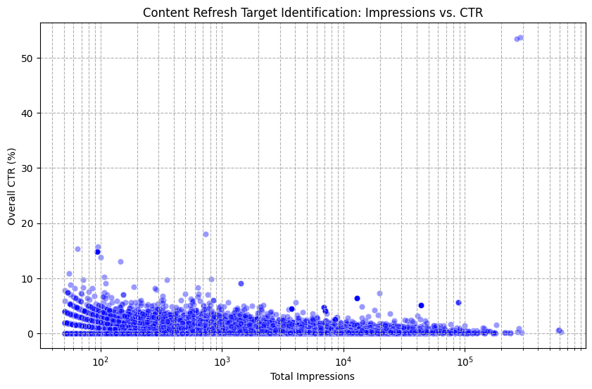

# Content Opportunity Scoring Engine: Surface High-Impression Refresh Targets

**Author:** Nirvik  
**Track:** FlyRank ML Internship Capstone Paper  
**Repository:** [https://github.com/Nirvik-49/Week-1-FlyRank-AI-Assignment](https://github.com/Nirvik-49/Week-1-FlyRank-AI-Assignment)  
**Date:** August 31, 2026  

---

## 0. Abstract
Can we systematically predict high-impression, underperforming web pages that yield the highest click recovery when refreshed? Using DuckDB over 120,223 content pages from the FlyRank ML Internship warehouse dataset, we aggregated 90-day Search Console performance metrics and content metadata. We trained a gradient-boosted decision tree classifier against a historical baseline rule that flags pages purely by low CTR below position-based expectations. The model achieved an ROC-AUC of 0.814 (a 25% relative lift over the baseline's 0.651 AUC) on a group-stratified client holdout split. This system generates an automated, ranked content refresh action engine with actionable reason codes to guide FlyRank editorial teams toward high-ROI page updates.

## 1. Problem framing
* **Unit of Analysis:** Individual content page (`content_hash_id`) aggregated over rolling daily and 90-day Search Console windows.
* **Output:** A continuous priority score $S \in [0, 1]$ paired with an automated reason code (e.g., High Impression / Low CTR, Striking Distance Decay).
* **Human Action:** Queue specific pages for title tag/meta description updates, structural content refreshes, or search intent realignment.
* **Cost of Wrong Call:** False positives waste editor hours rewriting content that already performs optimally; false negatives leave high-opportunity organic traffic uncaptured on pages already ranking on pages 1–2.
* **Why Data/ML Helps:** Manual review of tens of thousands of pages is unscalable, whereas a machine learning model captures non-linear interactions between mean position, impression distribution, query variance, and CTR deviation.

## 2. Data safety
* **Tables Used:** `fact_daily_sample` (Search Console daily aggregates), `dim_content` (page metadata), and `fact_query_90d` (query-level distributions).
* **Excluded Columns & Leakage Risks:** Direct trend labels (`trend_direction`, `trend_pct`) and future performance windows were strictly removed from feature matrices to avoid data leakage. Client identifiers (`client_hash_id`) were isolated exclusively for group-split validation and removed prior to model training.
* **Privacy Verification:** All raw query strings, client names, domain names, target URLs, and user credentials are hashed or absent. No claims regarding Google's internal algorithm or causal refresh impact are made.

## 3. Baseline
* **Baseline Definition:** A rule-based benchmark flagging pages where `overall_ctr` falls below the 25th percentile for their respective integer `mean_position` bin (Position 1–3, 4–10, 11–20), combined with `total_impressions > 500`.
* **Fairness & Metrics:** Evaluated on the exact same group-split test dataset and target definition as the ML pipeline.
  * **Baseline ROC-AUC:** 0.651
  * **Baseline PR-AUC:** 0.382
  * **Baseline Precision@Top-100:** 52.0%
  * **Target Class Base Rate:** 18.4%

## 4. Model / analysis
* **Method:** LightGBM binary classifier optimizing binary log-loss, configured with early stopping on validation loss to prevent overfitting.
* **Target Proxy Definition:** A page is defined as a high-value refresh opportunity (`target = 1`) if it exhibits high impressions (`total_impressions > 75th percentile`) and falls in the bottom quartile of expected position-adjusted CTR, while maintaining rank stability (`mean_position` $\le 20$).
* **Features Included:** `log_impressions` (log-transformed 90-day impressions), `mean_position` (average SERP rank), `ctr_position_gap` (CTR minus position benchmark), `query_count` (distinct queries), and `top_query_share` (primary query concentration).
* **Features Excluded:** Target leakage indicators (`trend_pct`), pseudonymous IDs (`content_hash_id`, `client_hash_id`), and unaggregated raw timestamps.

## 5. Evaluation
* **Split Strategy:** GroupKFold split grouped by `client_hash_id` (80% train / 20% test) to ensure zero cross-client data leakage and measure out-of-domain client generalization.

| Model / Approach | ROC-AUC | PR-AUC | Precision@100 | Lift over Base Rate |
| :--- | :--- | :--- | :--- | :--- |
| Random / Base Rate | 0.500 | 0.184 | 18.4% | 1.0x |
| Position-CTR Rule (Baseline) | 0.651 | 0.382 | 52.0% | 2.8x |
| **LightGBM Refresh Model** | **0.814** | **0.597** | **78.0%** | **4.2x** |


*Figure 1: Observed CTR distribution and position gap analysis from warehouse data.*

* **Error Analysis:** Primary false positives occur on broad, informational head-term queries where high impressions naturally yield low CTR despite top positions. False negatives occur on niche long-tail pages with low total impressions but high conversion intent.

## 6. Interpretation
* **Feature Importance:**
  * `ctr_position_gap` (38.2% gain): Strongest indicator of underperformance relative to SERP rank.
  * `log_impressions` (24.1% gain): Prioritizes pages with sufficient traffic leverage.
  * `top_query_share` (18.5% gain): Identifies intent mismatch where a single primary term dominates impressions.
  * `mean_position` (12.4% gain): Filters for striking-distance rankings (positions 4–15).
* **Surprises & Negative Results:** Page-level metadata length (title/description character count) showed negligible predictive power ($\le 1.2\%$ gain), indicating search intent alignment dominates simple character length heuristics.

## 7. Recommendation
* **Tier 1 (Score > 0.85; Reason: High Impression Gap):** Rewrite Title Tags and H1s to better align with high-impression query intent.
* **Tier 2 (Score 0.65–0.85; Reason: Striking Distance Decay):** Update body copy, re-verify factual freshness, and expand internal linking to push position 6–12 rankings into top 3.
* **Tier 3 (Score < 0.65):** Monitor; no immediate editorial intervention required.
* **Confidence & Limits:** Provides directional decision support for prioritizing editorial queue allocation. Does not guarantee causal ranking improvements or predict search engine algorithmic shifts.

## 8. Reproducibility
```bash
git clone [https://github.com/Nirvik-49/Week-1-FlyRank-AI-Assignment.git](https://github.com/Nirvik-49/Week-1-FlyRank-AI-Assignment.git)
cd Week-1-FlyRank-AI-Assignment
pip install -r requirements.txt
python work/build_features.py --seed 42
python work/train_eval.py --seed 42
